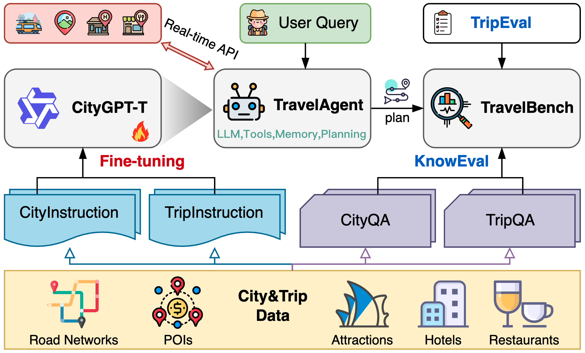

# CityGPT-Travel: Benchmarking Knowledge-Enriched LLM Agents for Urban Travel Planning

:triangular_flag_on_post: This is the repo of our paper summited to **CIKM  Resource Track 2025**.



## 🛠️ Requirements

- `LLaMA Factory` for finetuing LLMs
```bash
git clone --depth 1 https://github.com/hiyouga/LLaMA-Factory.git
cd LLaMA-Factory
pip install -e ".[torch,metrics]"
```

- `vLLM` for startting local LLMs services 
```bash
pip install vllm
```

## 📜 Quick Start

1. Download the `database`  we processed and packaged in [Google Drive](), then Unzip to the root directory of this project.

2. Prepare **CityGPT-T**
   ```bash
   # finetune 
   cd /usr/exp/CityGPT-Travel/train/beijing
   bash run_qwen2.5_sft.sh
   
   # lora merge
   CUDA_VISIBLE_DEVICES=0,1 llamafactory-cli export ./examples/merge_lora/qwen2.5_lora_sft.yaml
   
   # start service
   cd /usr/exp/CityGPT-Travel
   CUDA_VISIBLE_DEVICES=0 vllm serve ./model_zoo/beijing/qwen2.5-7b/lora_merged --port 23199 --dtype auto --api-key sk-token-2025 --enable-auto-tool-choice --tool-call-parser hermes
   ```

3. Run **TravelAgent**
   ```bash
   python run_agent.py --city_en=beijing --platform=vLLM --model_name=citygpt-t-beijing
   ```

4. Conduct **TravelBench**
   ```bash
   python ./travel_bench/know_eval.py --city_en=beijing
   python ./travel_bench/trip_eval.py --city_en=beijing
   ```